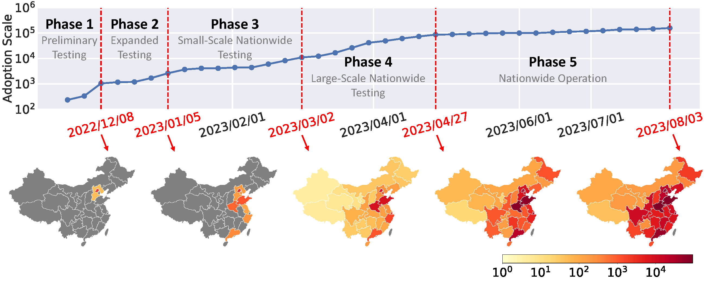
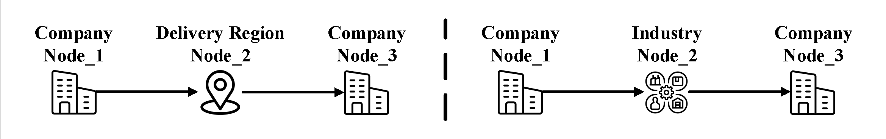
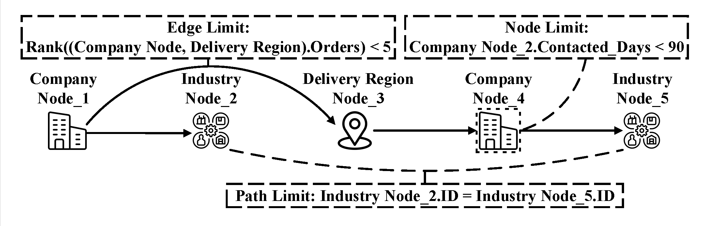

# CompGraph
This is the code of our framework, CompGraph, which has been effectively deployed in JD Logistics for enhancing customer acquisition. The following figure illustrates that, based on our prediction results, we made over 150,000 phone calls in China before August 2023. This strategy yielded an accuracy rate three times higher than the current standard practices. We are still using this framework for recommending new customers. As of December 1, 2023, more than 50,000 phone calls have been made in the last week alone. For more comprehensive details about our framework, please refer to our paper 'Complex-Path: Efficient Customer Conversion Prediction in Billion-Scale Heterogeneous Graph,' currently under review.

# Introduction for Complex-Path
The cornerstone of our strategy lies in the definiton 'complex-path', an innovative approach designed to extract detailed information from heterogeneous graphs. Unlike the traditional meta-path technique, complex-path is adept at capturing both the attribute information and the complex structures in the heterogeneous graph. The comparison below shows how complex-path effectively identifies companies related to our target under complex conditions, a task challenging for the meta-path method. Specifically, it shows how to select companies that are in the top 5 most frequently used delivery regions of the target company, share the same industry, and have signed contracts within the past 90 days.

*Meta-Path*

*Complex-Path: A Complex-Path is defined on the network schema \(HG = (V, E, X, R)\) and is represented as \(\ComplexPathSimName = (\mathrm{P}^{seq}, \mathrm{L}^o, \mathrm{L}^e, L^p)\). The sequence \(\mathrm{P}^{seq} = [(o_1, l_{1, 2}, o_{2}), \cdots, (o_i, l_{i, j}, o_j), \cdots]\) contains tuples ordered by their path occurrence. Each tuple \((o_i, l_{i, j}, o_j)\) connects the \(j\)-th edge \(l_{i, j}\) to the path through the prior \(i\)-th node of type \(o_{i}\), with \(i \in [1, j)\). The parameters \(\mathrm{L}^o = [\cdots, L_n^o, \cdots]\) and \(\mathrm{L}^e = [\cdots, L_r^e, \cdots]\) set individual limitations for different types of nodes and edges, respectively. Meanwhile, \(L^p\) limits the interactions between nodes and edges within the path*

# Brief Description for Our Code
The primary function of our code is to efficiently extract information based on complex-paths from a billion-scale heterogeneous graph, utilizing the distributed system Spark. The extracted data is then used to train our model and make prediction. We are continuously refining and optimizing our code, and will keep updating it. Currently, we have achieved the capability to perform a comprehensive weekly ranking for over one billion customers who have utilized JD Logistics services.

The 'kg_utils' folder includes our methods for extracting information from heterogeneous graphs, developed using Spark and complex-path. This folder also includes baseline methods like meta-path and k-hop sampling.

The 'kg_model' folder contains our model implemented with PyTorch, along with the baseline models referenced in our paper.

The 'Jupyter' folder includes code that utilizes the functions from the aforementioned folders to implement specified features.