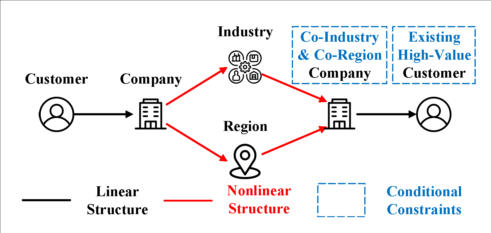

# CompNode
CompNode, a complex-path based effective and efficient node ranking framework for billion-scale heterogeneous graphs. It's design is based our paper "Complex-Path: Effective and Efficient Node Ranking with Paths in Billion-Scale Heterogeneous Graphs" (currently under review).


*Three stages in the workflow of our CompNode framework.*

# Complex-Path
Our framework is mainly based on a new generalized path schema called 'Complex-path':

<p align="center">

</p>

It's designed for defining non-linear conditional path types in a standard form, which we find quite useful in real-world scenarios. Below is an example of a non-linear conditional path type:

<p align="center">

</p>
<div align="center">An example of nonlinear conditional path type. (Link each customer to existing high-value customers via co-industry and co-region relations.)</div>
<br>

Based on our complex-path definition, the configuration file for this example path type can be found [here](main/config/Complex_Paths/Complex_Path_Example.json). The configuration guide for complex-paths can be found here. [here](main/config/Complex_Paths/CONFIG_GUIDE.md).

# Demonstration on Microsoft Academic Graph
First, please download the dataset that meets our framework's format requirements [here](https://drive.google.com/file/d/15HLmx_PS6gPB7rsArhWmQ72qGw265-sP/view?usp=sharing). 

After unzipping the dataset, place it in your HDFS file system and modify the path corresponding to the 'data_dir' key in [this file](main/config/Complex_Graphs/Mag240m.json) to match the location where you've placed the dataset.

Then, you can directly run the code in [this file](main/example/complex_path_example.py) to obtain the aggregation results of the three path types specified in the [configuration file](main/config/Complex_Paths/Mag240m_Paths_Example.json), as well as the accuracy of the paper subject area prediction based on the aggregation results.

# Code Structrue

```
CompNode/
│
├── compg/                   # Core components
│   ├── graph/               # Code for building heterogeneous graphs in tabular form
│   ├── hdfs/                # Code for HDFS system-related operations
│   ├── model/               # PyTorch code for various models
│   ├── pyspark/             # Code for Spark system-related operations (e.g., table Aggregation)
│   ├── python/              # Code for some Python-based operations (e.g., decorators)
│   └── Utils/               # Additional utility functions
│
├── main/                    # Implementation of various tasks
│   ├── config/              # Configuration files for various tasks
│   ├── data_preprocess/     # Code related to data preprocessing tasks
│   ├── example/             # Example code for the MAG dataset
│   └── node_prediction/     # Code for node prediction tasks using various models
```

# Requirements
```
pyspark==3.0.0
pytorch==1.8.0
```

# Real-world Deployment

This framework has been effectively deployed in JD Logistics for finding top potential high-value customers. The following figure illustrates that, based on our prediction results, we made over 262,720 phone calls in China before October 2023. This strategy outperforms the previously deployed method by 252% in success rate. We are still using this framework for recommending customers with more potential value. As of December 1, 2023, more than 50,000 phone calls have been made in the last week alone. For more comprehensive details about our framework, please refer to our paper.


